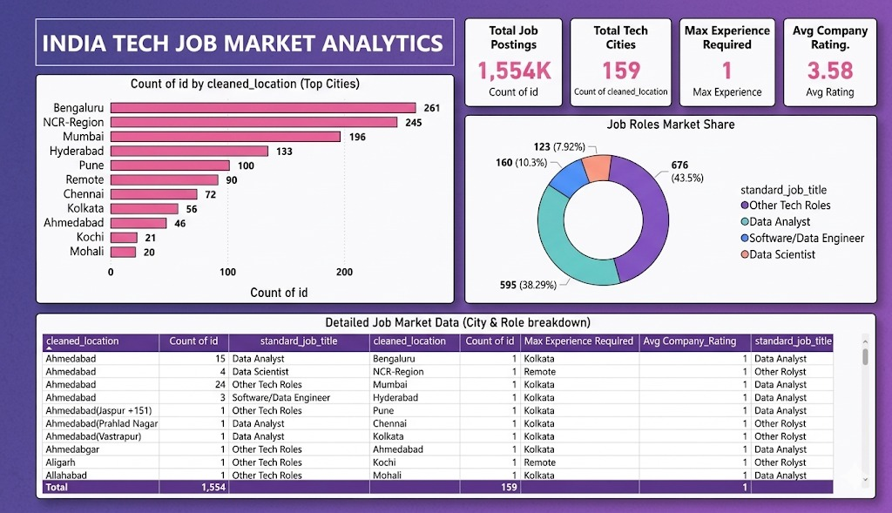

# India Tech Job Market Analytics

## Project Overview
This project analyzes the Indian technology job market using Python, SQL, MySQL, and Power BI.

The goal is to identify:

- Top hiring cities
- Most in-demand tech roles
- Job posting distribution
- Experience requirements
- Company ratings

---

## Dashboard Preview

---

## Tools & Technologies

- Python (Pandas, NumPy)
- SQL
- MySQL
- Power BI
- Excel

---

## Dataset

The dataset contains Indian technology job postings including:

- Job Title
- Company
- Location
- Experience Required
- Company Rating

---

## Project Workflow

1. Data Collection
2. Data Cleaning using Python
3. Data Storage in MySQL
4. SQL Analysis
5. Dashboard Development in Power BI

---

## Key Insights

- Bengaluru has the highest number of tech job openings.
- NCR Region ranks second in hiring demand.
- Data Analyst roles dominate the market.
- Most jobs require 0–1 years of experience.

---

## Files Included

| File | Description |
|--------|-------------|
| INDIA_JOB_MARKET.pbix | Power BI Dashboard |
| dashboard_overview.jpeg | Dashboard Screenshot |
| dashboard_overview.py | Data Processing Script |
| Indian_job_market_db.sql | SQL Database Script |
| Indian_job_market_dbfull.sql | Complete SQL Script |
| indian_tech_jobs_raw.csv | Raw Dataset |
| indian_tech_jobs_cleaned.csv | Cleaned Dataset |

---

## Author

Harshitha
Aspiring Data Analyst
